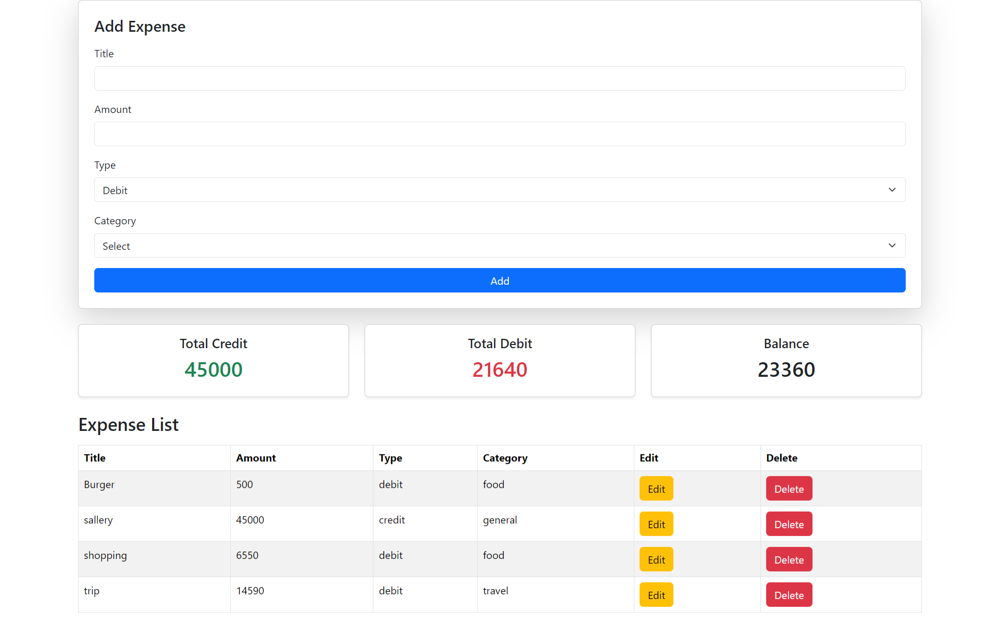

1️⃣ Clean & Professional

“A modern Expense Tracker built with React and Context API — featuring real-time balance calculation, editable transactions, and a clean Bootstrap UI.”

2️⃣ Developer-Focused

“A lightweight React Expense Manager using Context API for global state, React-Bootstrap for UI, and fully responsive CRUD-based transaction handling.”

3️⃣ Short & Attractive

“Smart expense tracking with React — Add, Edit, Delete, and analyze your spending in a beautiful UI.”

4️⃣ Detailed & Impressive

“A fully functional Expense Tracker built using React + Context API with smooth form handling, editable history, dynamic credit/debit summary, and a polished React-Bootstrap interface.”

5️⃣ README Intro Style

“🚀 A simple yet powerful Expense Tracker built in React. Manage daily expenses, visualize total credit/debit, and maintain a clean financial overview — all wrapped in a modern Bootstrap-powered UI.”

6️⃣ UI Highlight

“✨ Sleek React Expense Tracker featuring modern Bootstrap design, responsive tables, and real-time financial calculations.”

7️⃣ Beginner-Friendly

“An easy-to-understand Expense Tracker using React, Context API, and Bootstrap — perfect for learning state management and UI structuring.”

8️⃣ Professional Product Style

“Track your expenses effortlessly with this React-based Expense Tracker. Elegant UI, fast performance, and seamless CRUD operations.”